
<h1>Shopping Mall API Project</h1>

쇼핑몰 서비스 백앤드 API 및 데이터베이스 구축

<h2>💁 Business Logic</h2>

- 관리자: 상품을 등록, 수정, 삭제 할 수 있다.
- 유저: 상품을 주문, 조회, 취소할 수 있다.

<h2>📚 STACKS</h2>

 

#### JPA, JWT, Security

<h2>😊 Init Domain</h2>

 Authority 

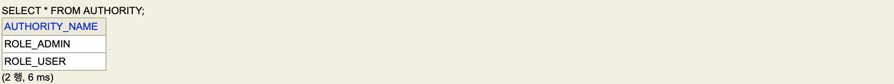

 User 

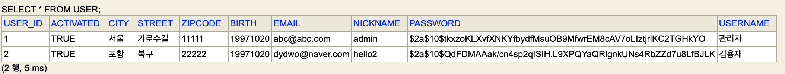

 User_Authority 

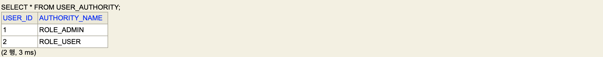

 Item 

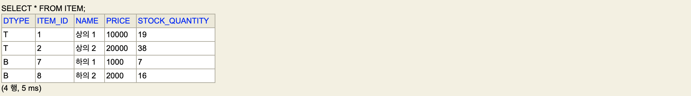

 Top 

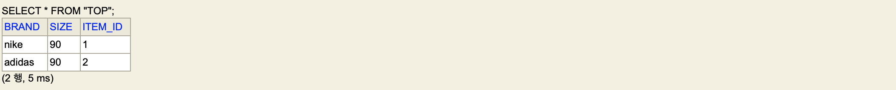

 Bottom 

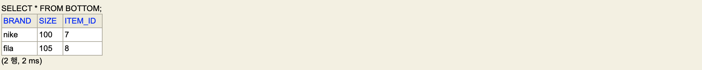

 Delivery 

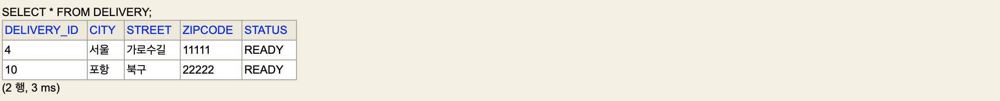

 Order_Item 

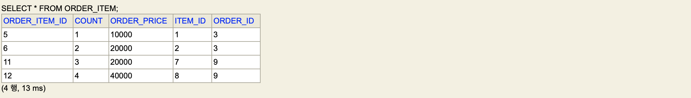

 Orders 

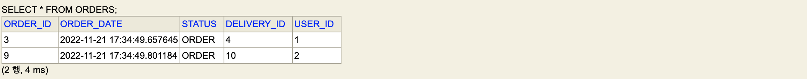

<h2>🤚 Swagger UI</h2>

### 회원 관리 API
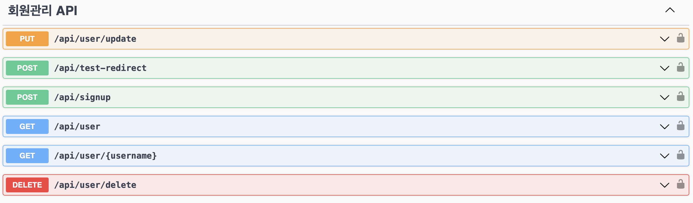

### 상품 API
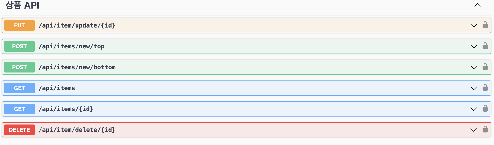

### 주문 API
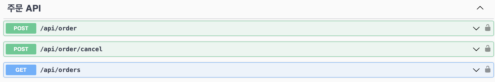

### 인증 API
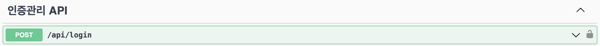

<h2> ❌ Common Error </h2>

| error | message           | HttpStatus   |
|-------|-------------------|--------------|
| E000  | 이미 가입되어 있는 이메일입니다 | BAD_REQUEST  |
| E001  | 멤버를 찾을 수 없습니다     | NOT_FOUND    |
| E002  | 필수 항목이 누락되었습니다    | BAD_REQUEST  |
| E003  | 닉네임이 중복됩니다        | BAD_REQUEST  |
| E004  | 토근을 보유하고 있지 않습니다  | UNAUTHORIZED |
| E005  | 이메일을 찾을 수 없습니다    | BAD_REQUEST  |
| E006  | 재고가 모두 소진되었습니다    | BAD_REQUEST  |
| E007  | 아이템을 찾을 수 없습니다    | BAD_REQUEST  |